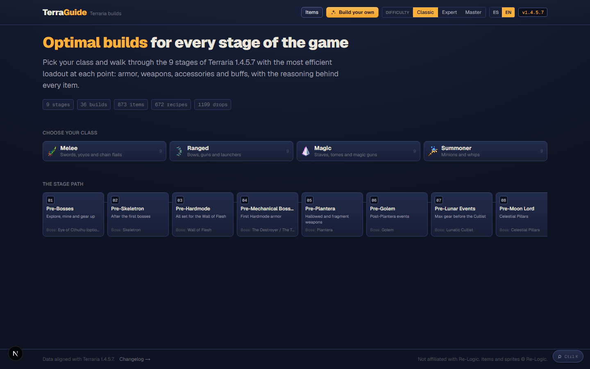
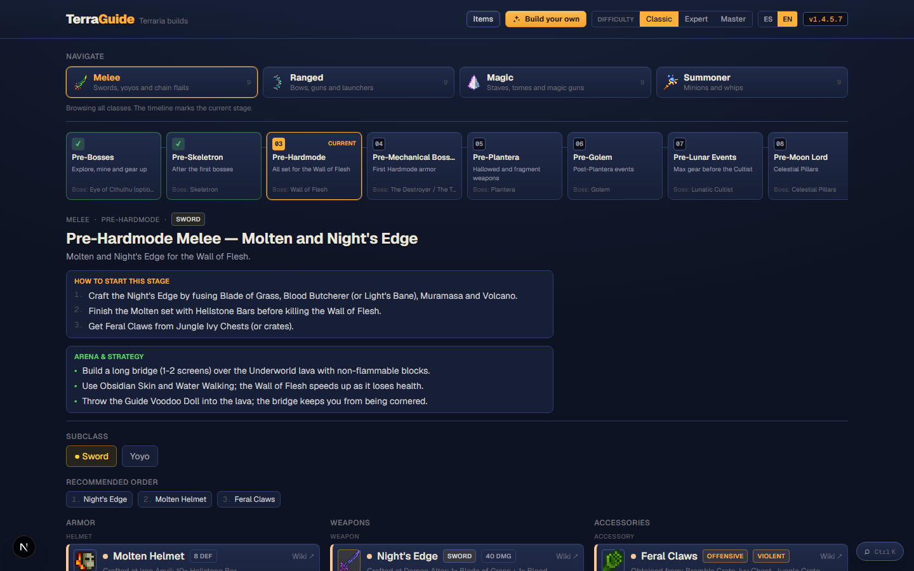
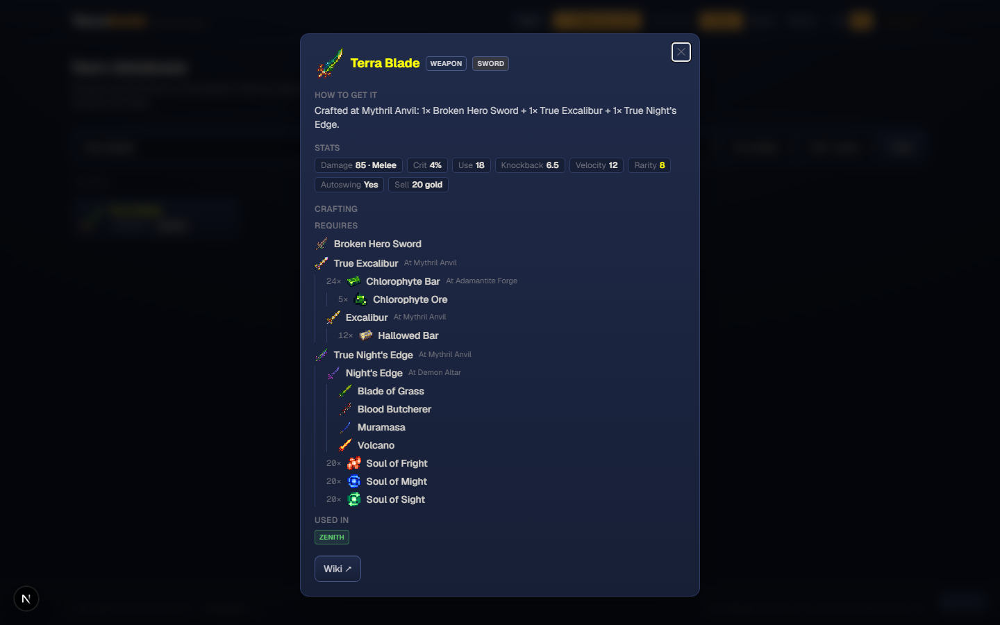
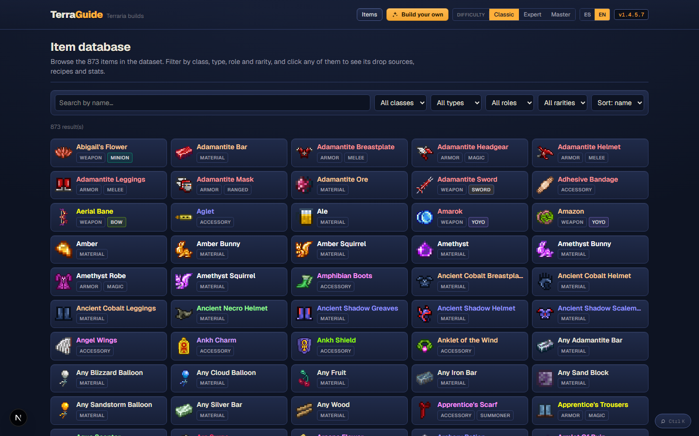
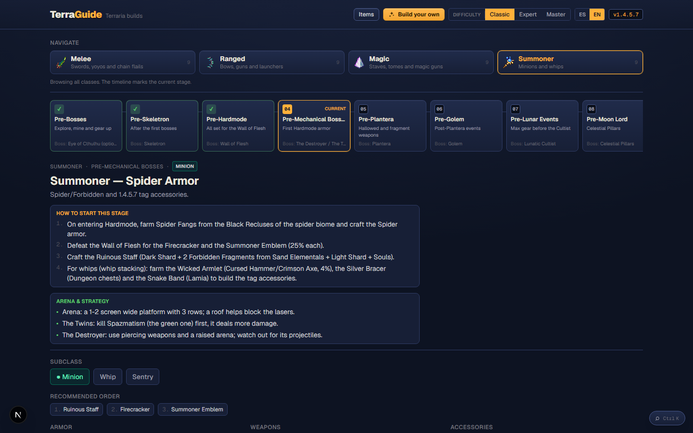
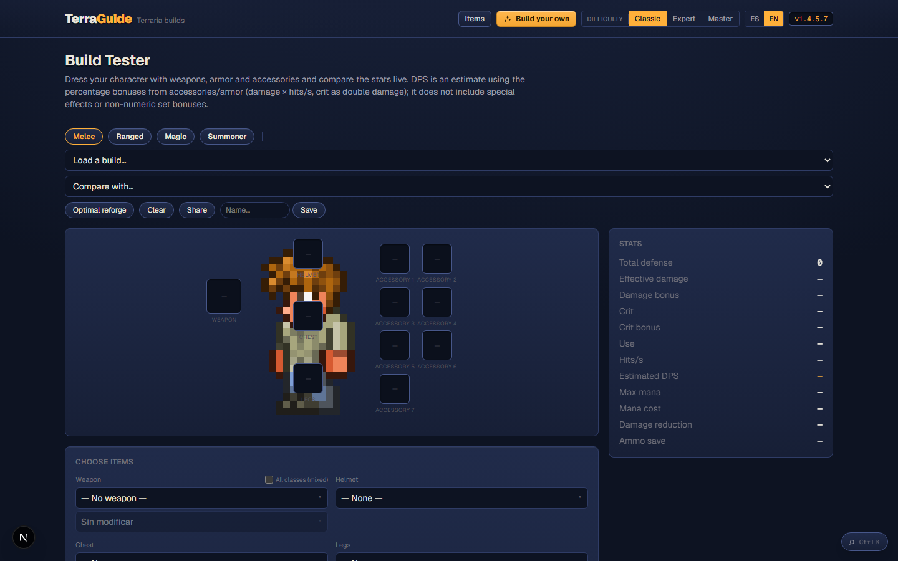

# TerraGuide — an interactive Terraria 1.4.5.8 build guide & loadout planner

Hi everyone! I'm **Dkaisak**.

I've been playing Terraria since I was about 15 — I'm 29 now. I started back when **Molten was the strongest armor set in the game**, and I never really stopped. These days I work as a **freelance developer**, and I still love this game, so I poured that love (and my job) into a little project I'd like to share with you: **TerraGuide**.

It's an interactive guide that tells you **what to use at every stage of the game** for every class — and it also lets you build and compare your own loadouts.

> **Status: early testing phase.** TerraGuide is a work in progress. The data and features are usable, but there will be rough edges, missing items and the occasional mistake. That's exactly why I'm posting it now: I want the community to **use it, break it and tell me what to fix**, so we can keep updating and improving it together.

**Repository:** https://github.com/Dkaisak/TerraGuide

---

## What it is

Pick a **class** (Melee / Ranged / Magic / Summoner) and a **stage** (9 milestones, from Pre-Bosses to Post-Moon Lord), and TerraGuide shows the recommended loadout — armor, weapon(s), accessories, buffs and ammo — **with the reasoning behind every single item**.

It's not just a list of gear: every entry explains *why* it's there, *how* to get it, and *what it costs you* in terms of farming.

## Highlights

- **36 curated builds** (4 classes × 9 stages) with **subclass variants**: sword/yoyo, bow/gun/launcher/thrown, minion/whip/sentry.
- **Every item explains itself**: stats, drop sources with rates per difficulty, NPC shops and prices, a full **crafting tree** and an aggregated **material list**.
- **Difficulty-aware**: accessory slots change with Classic / Expert / Master (5/6/7) and Expert-only items are filtered out in Classic.
- **"How to start this stage"** mini-guide plus **arena & strategy tips** for every stage.
- **Farming route**: all the items you need, grouped by **zone/biome**, so you know where to go.
- **Item database** with filters by class, type, role and rarity.
- **Mechanics notes** — e.g. the new **1.4.5.7 whip stacking and tag slots** — each linked to the wiki.
- **Build Tester**: dress a paper doll, watch **live stats** (defense, damage, crit, estimated DPS), apply **recommended reforges**, **save/share** builds by URL, and **compare two builds A/B** — including a fully custom "Build B".
- **Global search** (Ctrl/⌘+K) that opens the item card right inside the app.
- **Bilingual**: the whole interface and content are available in **Spanish and English**.

## Screenshots



*Pick a class and a stage, and get the full loadout with the reasoning behind every item.*



*Every item card opens a full breakdown: how to get it, stats, drop sources and its crafting tree.*









## The data

Everything is hand-curated JSON and validated by a script:

- **873 items**, **32 armor sets**, **672 recipes**, **1,199 drop sources**, **36 builds**.
- Aligned to **Terraria 1.4.5.8** and cross-checked against the Official Terraria Wiki. Nothing is invented — if it's in the guide, it's in the dataset.

## Tech

Next.js 16 (App Router, static generation), TypeScript, Tailwind v4, zod for data validation and MiniSearch for search. There's **no backend** — it's a static site, so it can be hosted anywhere.

## Try it locally

```bash
git clone https://github.com/Dkaisak/TerraGuide.git
cd TerraGuide
npm install
npm run dev   # http://localhost:3001
```

## Feedback is the whole point

This project only gets better with your input. It started as a personal tool to stop alt-tabbing between the wiki and my inventory, but the goal now is to turn it into something the whole community can rely on — and for that I need **constant feedback**.

So please, tell me anything:

- Wrong drop rate, wrong source or missing item?
- A build choice you disagree with (or a better alternative for a stage)?
- A missing mechanic, a bug, a confusing screen, a translation that reads wrong?
- A feature you'd like to see?

Open an **issue** on GitHub, reply here, or send me a DM. I'll keep iterating and pushing updates based on what you report — accuracy and usefulness matter more to me than shipping fast, and I'd rather fix something than leave it misleading.

If you want to help build it, **PRs are welcome**: the dataset lives in plain JSON and a validator script keeps everything consistent, so it's easy to contribute data or fixes.

## What's next

- A hosted public version.
- Per-item English text for the few descriptions that are still generated.
- More mechanics notes as 1.4.5.x evolves.
- Regular data updates and fixes driven by community feedback.
- And whatever else you ask for!

## Disclaimer

This is an unofficial fan project and is **not affiliated with Re-Logic**. Item names and sprites belong to Re-Logic; sprites are sourced from the Official Terraria Wiki.

---

## Extras (not part of the post body)

**Suggested thread title:**

> TerraGuide — an interactive 1.4.5.8 build guide & loadout planner (open beta, feedback wanted)

**Short blurb (social / cross-post):**

> TerraGuide is an open-source, interactive Terraria 1.4.5.8 build guide: 36 curated builds with the reasoning behind every item, drop sources and crafting trees, a farming route by biome, a Build Tester with live stats and A/B comparison, and full ES/EN support. It's in early testing — try it, break it, and tell me what to fix. https://github.com/Dkaisak/TerraGuide
